# Equity T₹ade (E-T₹ade)

### Edit 
Publishable tokens have expired and thus cannot be used to fetch data

## Features
- Register: Any person can register to make a new account.
- Log In: Registered users can access the main website by logging in.
- Quote: A registered user can quote a price for a stock and see depictive graphs.
- Add: Users can add shares of a stock.
- Index: To show the stocks and their graphs in the user's account.
- Remove: Users can remove shares of a stock.
- History: User can see the past transaction history.
- The stocks are limited to only NYSE stock symbols.

## Installation-

1] Clone the repository to your machine.

2] Run the command `pip install -r requirements.txt`

3] Once all the dependancies have been installed, run the command `flask run` in the repository.

4] This should start a local server and you can access it on your browser.

## Pictures
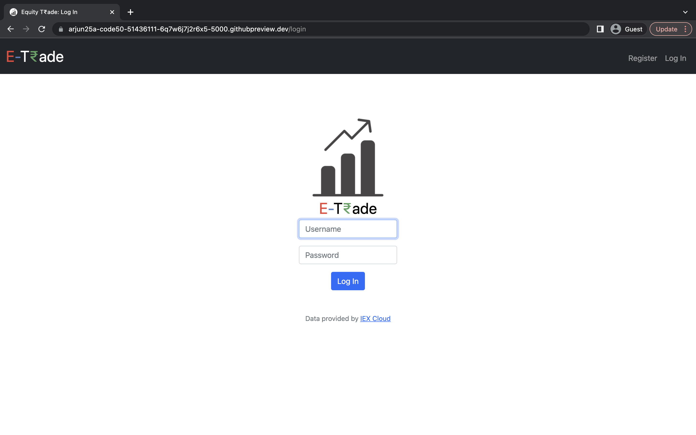
 
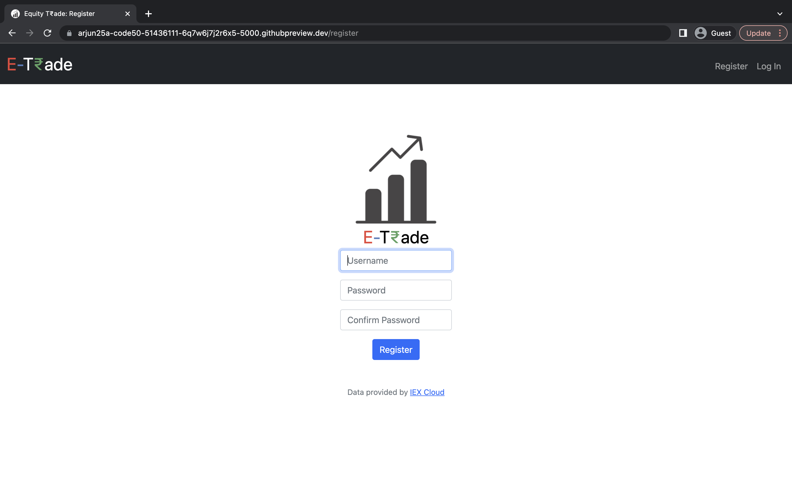
 
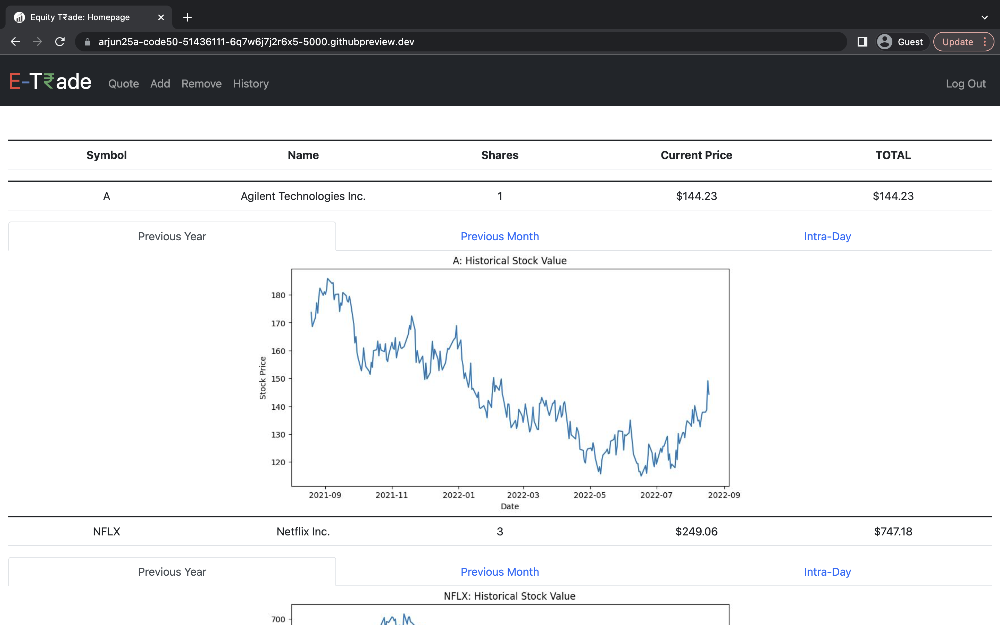
 
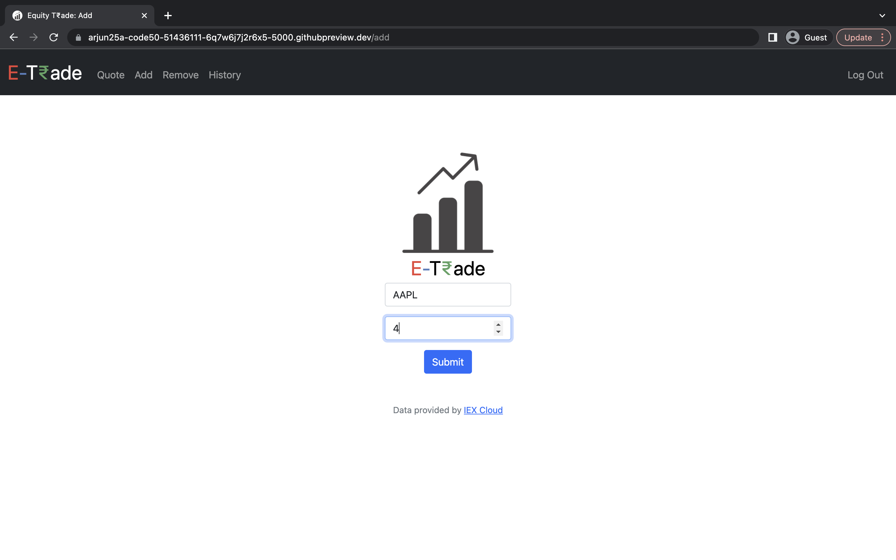
 
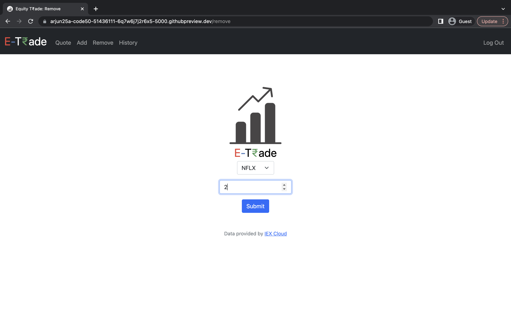
 
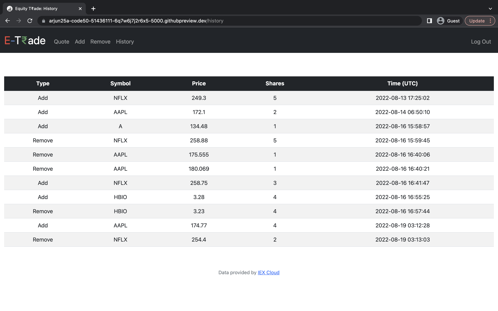
 

## More Information

1] [helpinglib.py](helpinglib.py) conatains all the helping functions.

2] [finance.db](finance.db) is the sqlite3 database in which all the information is stored.

3] The stock data is provided by [IEX Cloud](https://iexcloud.io/)

4] All the Libraries to be installed are in [requirements.txt](requirements.txt)

5] For passwords, at least one uppercase, one lowercase, one number, one symbol(not including spaces) and 8-16 characters should be present.

## [helpinglib.py](helpinglib.py) Functions
1] lookup function gets quote for symbol 
 
2] Users can enter their own API token 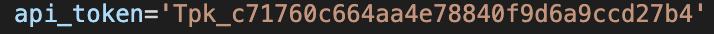
 
3] Generating error message (Credit: [Jace Browning](https://github.com/jacebrowning/memegen#special-characters)) 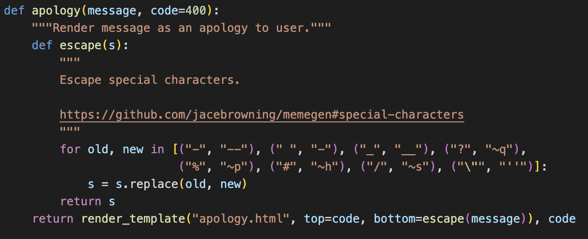
 
4] login function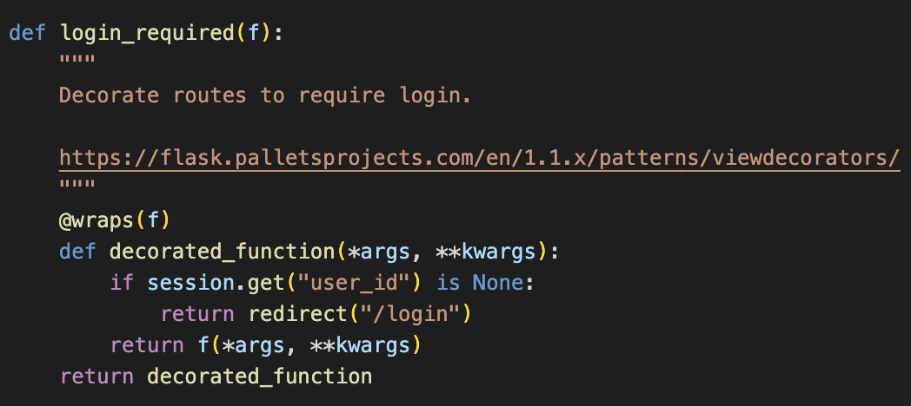
 
5] Plotting previous year data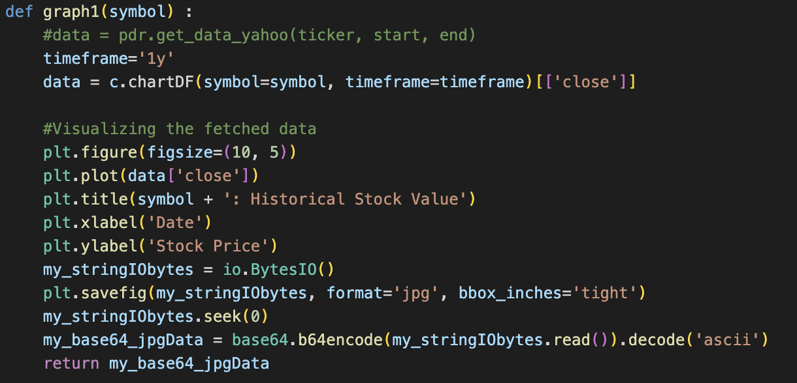
 

6] Plotting previous month data per day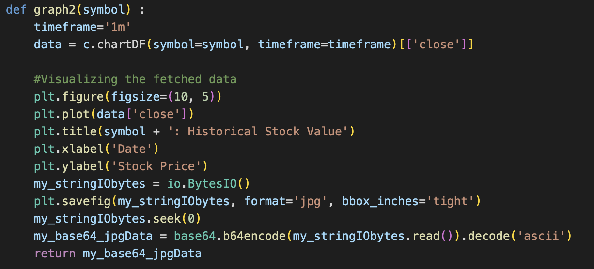
 

7] Plotting intra day data per minute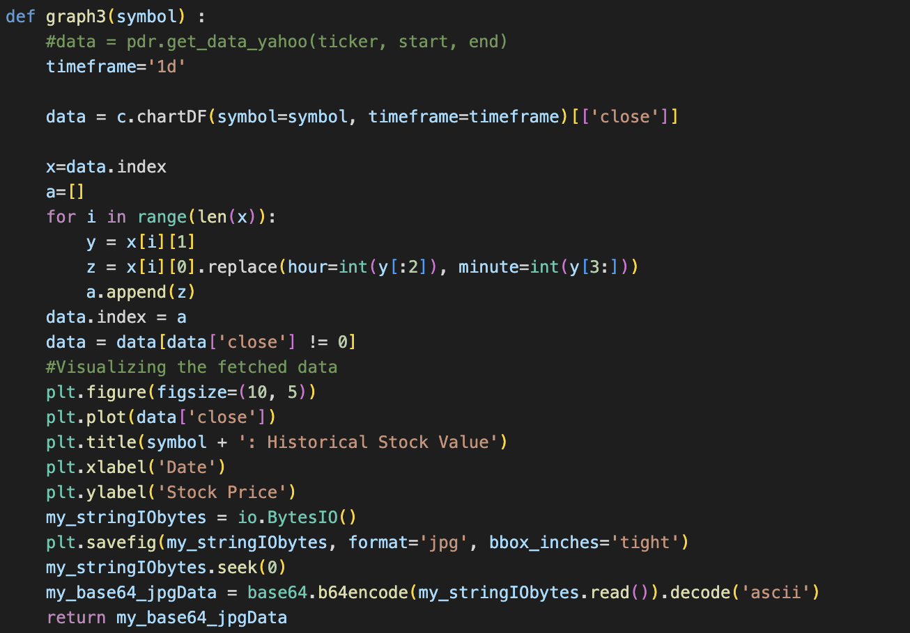
 
>The for loop is needed in this particular case because of limitations of data provided IEX API's for intra day transactions.
>>The index of the pandas dataframe is two columns in this case and hence not in the correct form to input into matplotlib functions, thus the for loop is needed to adapt it to matplotlib

## CS50
>This was my final project for CS50x.

>CS, python, flask, flask web framework, web development, CS50

### Video Demo: https://youtu.be/ggmbvd2J6As

### [LinkedIn Arjun Aggarwal](https://www.linkedin.com/in/arjun-aggarwal-919051241/)

## Thank You So Much
